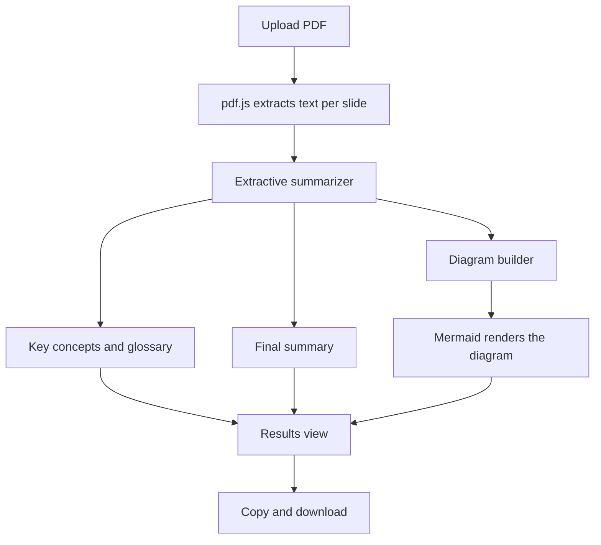

# Course Recap Generator

Turn course slides into a clear recap. Upload a PDF and get a slide-cited summary, key concepts, a glossary, a final summary and a diagram, all generated in your browser.

- Live site: https://course-recap-generator.netlify.app

## Features

- **PDF upload:** drag and drop or choose a file. Text is extracted page by page with pdf.js.
- **Key concepts:** the main ideas of the deck, each linked to the slide it came from.
- **Glossary:** repeated technical terms with the slide where they first appear.
- **Final summary:** 8 to 10 short lines covering the whole deck, with slide numbers.
- **Diagram:** a Mermaid diagram of the deck's topics, with a toggle between flowchart and mindmap.
- **Export:** copy or download the summary as Markdown, and the diagram as SVG or Mermaid source.
- **Sample recap:** a built-in example (AI Coding Techniques, Day 3) that hides as soon as you upload your own file.
- **Private by design:** everything runs locally in your browser. No account, no upload, no server.
- **Light and dark mode** and a responsive layout.

## How it works



The summary is **extractive**: it selects and orders the most important sentences and topics from the slides and does not rewrite them or use an LLM. Every item shows the slide number it came from, so you can check it against the source.

## Run locally

Requirements: Python 3 (only for a local web server) and an internet connection (pdf.js and Mermaid load from a CDN).

```powershell
cd site
python -m http.server 8000
```

Open `http://localhost:8000`. Use a local server rather than opening `index.html` directly, because pdf.js can fail on `file://`.

## Tech stack

- HTML, CSS and vanilla JavaScript, with no build step
- [pdf.js](https://mozilla.github.io/pdf.js/) 3.11.174 for text extraction
- [Mermaid](https://mermaid.js.org/) 11 for diagrams

## Project structure

```
Course_Recap_Generator/
├── site/             the web app: index.html, style.css, script.js
├── input/            course PDFs; text/ holds extracted slide text
├── output/           summary.md and diagram.mmd for the built-in sample
├── docs/             plan.md, architecture.md, screenshots
├── .opencode/        agent and skill definitions used to build the content
├── extract.py        converts PDFs in input/ to per-slide text
└── opencode.json     MCP server configuration
```

## Limitations

- Summaries are approximate because they are extractive, not written by an LLM.
- Scanned or image-only PDFs have no text layer, so nothing can be extracted from them.
- Text from some PDFs contains broken ligatures (for example "dierent" instead of "different").
- Tables and diagrams inside slides are not read.
- The diagram reflects the topics detected in the text and may need a manual check for large decks.